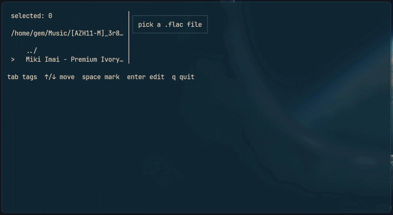

# metaflac


Terminal UI for editing FLAC Vorbis comments and cover art.

```
go install .        # or: go build
metaflac [file.flac|dir]
```

With no argument it browses the current directory.

## Keys

| Key | Action |
|-----|--------|
| `↑`/`k`, `↓`/`j` | move |
| `enter`/`e` | edit selected tag (`KEY=VALUE`) |
| `a` | add tag |
| `d` | delete tag |
| `c` | set cover image (PNG/JPEG path) |
| `s` | save |
| `r` | revert (clears the batch in batch mode) |
| `tab` | switch between tags and file browser |
| `q` / `ctrl+c` | quit |

In the file browser: `enter`/`l` opens a file or directory, `space` marks files for batch editing (save or revert pending edits first).
In batch mode, `s` applies the edited tags and cover to every marked file.
